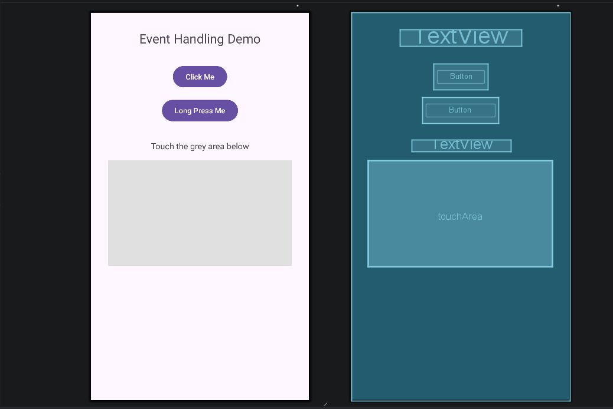

# Event Handling Codelab

Event Handling Codelab is an Android project built with **Android Studio** to demonstrate how to implement and manage event listeners in Kotlin.  
It covers handling user interactions such as clicks, long presses, and other UI events in a structured way.

---

## 📱 Features
- Example `MainActivity.kt` showcasing event handling in Kotlin
- XML layout (`activity_main.xml`) with interactive UI components
- Resource management (colors, strings, themes)
- Gradle build setup with Kotlin DSL
- Unit and instrumented test examples

---

## 📸 Screenshots

Here’s how the Event Handling Codelab looks:

---

